# Post-Deployment Vulnerability Remediation (PDVD)

> **TL;DR:** A graph-based vulnerability management platform that tracks CVEs from discovery through production deployment to remediation, with multi-tenant RBAC, SLA compliance tracking, and automated workflows.

[](LICENSE)
[](https://golang.org/)
[](https://arangodb.com/)

## 📖 Documentation

- **[Complete Design Document](design.md)** - Full technical architecture, API specs, and implementation details
- **[Hub-and-Spoke Architecture](hub_and_spoke_guide.md)** - Deep dive into graph database design and performance

## 🎯 What Problem Does This Solve?

For every high-risk OSS vulnerability, security teams need answers to four questions:

```mermaid
graph LR
    Q1[❓ What's the threat?] --> A1[✅ CVE-2024-1234<br/>CRITICAL 9.8 CVSS]
    Q2[❓ Where do I fix it?] --> A2[✅ frontend-app repo<br/>lodash@4.17.20]
    Q3[❓ Where is it running?] --> A3[✅ prod-k8s-us-east<br/>edge-device-001]
    Q4[❓ How do I fix it?] --> A4[✅ Upgrade lodash@4.17.21<br/>Auto-create Jira ticket]
    
    style Q1 fill:#ff6b6b
    style Q2 fill:#ffd43b
    style Q3 fill:#cc5de8
    style Q4 fill:#51cf66
```



## 🏗️ Architecture in 30 Seconds


**Key Innovation:** Hub-and-Spoke architecture with PURL nodes = **99.89% less edges**, **<3s queries**

## 🚀 Quick Start

```bash
# 1. Start ArangoDB
docker run -p 8529:8529 -e ARANGO_ROOT_PASSWORD=password arangodb:latest

# 2. Run PDVD Backend  
export ARANGO_HOST=localhost ARANGO_PASS=password
go run main.go

# 3. Access APIs
# REST: http://localhost:3000/api/v1
# GraphQL: http://localhost:3000/api/v1/graphql
```

## 🔐 Multi-Tenant RBAC with GitOps


### RBAC Configuration (Peribolos-style)

```yaml
# rbac.yaml (stored in Git)
orgs:
  - name: acme-corp
    display_name: ACME Corporation
    members:
      - username: alice
        role: owner      # Full access + billing
      - username: bob  
        role: editor     # Read + write

users:
  - username: alice
    email: alice@acme.com
    auth_provider: local
```

**4 Roles:**
- `owner` - Full access + billing management
- `admin` - Full access + user management
- `editor` - Read/write to resources
- `viewer` - Read-only access

**Features:**
- ✅ Token-based email invitations (48h expiry)
- ✅ JWT auth with HttpOnly cookies
- ✅ GitHub App integration
- ✅ Org-scoped data isolation
- ✅ GitOps workflow with auto-sync

## 📊 Dashboard Metrics (NIST/DoD Compliant)


**SLA Targets:**

| Severity | Standard | Mission-Critical |
|----------|----------|------------------|
| Critical | 15 days  | 7 days           |
| High     | 30 days  | 15 days          |
| Medium   | 90 days  | 90 days          |
| Low      | 180 days | 180 days         |

## 🔌 API Examples

### REST API

```bash
# Sign-up (creates org + sends invitation)
POST /api/v1/signup
{
  "username": "alice",
  "email": "alice@acme.com",
  "first_name": "Alice",
  "last_name": "Smith",
  "organization": "acme-corp"
}

# Login
POST /api/v1/auth/login
{ "username": "alice", "password": "secure-pass" }
# Returns: Set-Cookie: auth_token=<jwt>; HttpOnly

# Upload Release + SBOM
POST /api/v1/releases
{
  "name": "payment-service",
  "version": "2.1.0",
  "gitcommit": "abc123",
  "org": "acme-corp",
  "sbom": { "content": { /* CycloneDX */ } }
}

# Sync Deployment
POST /api/v1/sync
{
  "endpoint_name": "prod-us-east-1",
  "releases": [{
    "release": { "name": "payment-service", "version": "2.1.0" }
  }],
  "endpoint": {
    "name": "prod-us-east-1",
    "endpoint_type": "eks",
    "environment": "production"
  }
}
```

### GraphQL API

```graphql
# Get vulnerabilities (org-scoped)
query {
  release(name: "payment-service", version: "2.1.0") {
    vulnerabilities {
      cve_id
      severity_rating
      severity_score
      package
      fixed_in
    }
    synced_endpoints {
      endpoint_name
      environment
    }
  }
}

# Dashboard with MTTR (org-filtered)
query {
  dashboardMTTR(days: 180, org: "acme-corp") {
    executive_summary {
      total_new_cves
      mttr_all
      mttr_post_deployment
      open_cves_beyond_sla_pct
    }
    by_severity {
      severity
      mttr
      open_count
      fixed_within_sla_pct
    }
  }
}
```

## 🗄️ Database Schema


**Collections:** `cve`, `purl`, `sbom`, `release`, `endpoint`, `sync`, `cve_lifecycle`, `users`, `invitations`, `roles`, `orgs`

## 🎯 Key Features

### ✅ Hub-and-Spoke Architecture
- **99.89% edge reduction** vs traditional graph
- **<3s queries** on millions of records
- **Linear scalability** O(N+M)

### ✅ Multi-Tenancy
- **Org isolation:** Data scoped by membership
- **Empty org = global:** Users with `orgs: []` see all
- **4-level roles:** owner → admin → editor → viewer

### ✅ CVE Lifecycle Tracking


- Tracks: introduced_at, remediated_at, days_to_remediate
- Post-deployment detection flags
- MTTR calculation

## 📈 Performance

| Metric           | Target       | Actual    |
|------------------|--------------|-----------|
| API Response     | <3s          | <1s (p95) |
| CVE Ingestion    | 50K/hour     | ✅         |
| Concurrent Users | 100+         | ✅         |
| Database Scale   | 1M+ releases | ✅         |

## 🛠️ Technology Stack

- **Backend:** Go 1.21+, Fiber, GraphQL
- **Database:** ArangoDB 3.11+
- **Auth:** JWT, bcrypt, HttpOnly cookies
- **CVE Data:** OSV.dev API
- **GitOps:** go-git

## 📦 Environment Variables

```bash
ARANGO_HOST=localhost
ARANGO_PASS=your-password
JWT_SECRET=change-me-in-production
ADMIN_USERNAME=admin
ADMIN_PASSWORD=secure-password
RBAC_REPO=https://github.com/org/rbac
SMTP_HOST=smtp.gmail.com
SMTP_USERNAME=noreply@pdvd.com
BASE_URL=https://pdvd.example.com
GITHUB_APP_ID=123456
```

## 🚢 Deployment

```bash
# Docker Compose
docker-compose up -d

# Kubernetes
helm install pdvd ./helm/pdvd-backend
```

## 📝 License

Apache License 2.0

---

**Built with ❤️ by the Ortelius community** | [Website](https://ortelius.io)
