# PDVD System Design Document

**Version:** 2.0  
**Last Updated:** January 2026  
**Status:** Production

## Table of Contents

1. [Executive Summary](#executive-summary)
2. [System Architecture](#system-architecture)
3. [Multi-Tenant RBAC System](#multi-tenant-rbac-system)
4. [Authentication & Authorization](#authentication--authorization)
5. [Database Schema](#database-schema)
6. [API Specification](#api-specification)
7. [CVE Lifecycle Management](#cve-lifecycle-management)
8. [Hub-and-Spoke Graph Design](#hub-and-spoke-graph-design)
9. [Deployment Architecture](#deployment-architecture)
10. [Security Considerations](#security-considerations)

---

## Executive Summary

PDVD is a graph-based vulnerability management platform that tracks CVEs from discovery through production deployment to remediation. The system uses a hub-and-spoke architecture with PURL (Package URL) nodes to achieve 99.89% edge reduction compared to traditional graph designs, enabling linear O(N+M) scalability.

### Key Capabilities

- **Multi-Tenant RBAC:** Organization-based access control with 4-level role hierarchy
- **GitOps Workflow:** YAML-driven configuration with automatic sync from Git repositories
- **CVE Lifecycle Tracking:** Complete audit trail from introduction to remediation
- **Real-Time Dashboard:** MTTR metrics, SLA compliance, and executive summaries
- **Automated Workflows:** GitHub App integration, email invitations, Jira ticket creation

### Design Principles

1. **Graph-First:** Relationships are first-class citizens
2. **Hub-and-Spoke:** Minimize edges through central hub nodes
3. **Multi-Tenancy:** Org-scoped data with flexible global access
4. **GitOps:** Infrastructure and RBAC as code
5. **Zero-Trust:** JWT authentication with HttpOnly cookies

---

## System Architecture

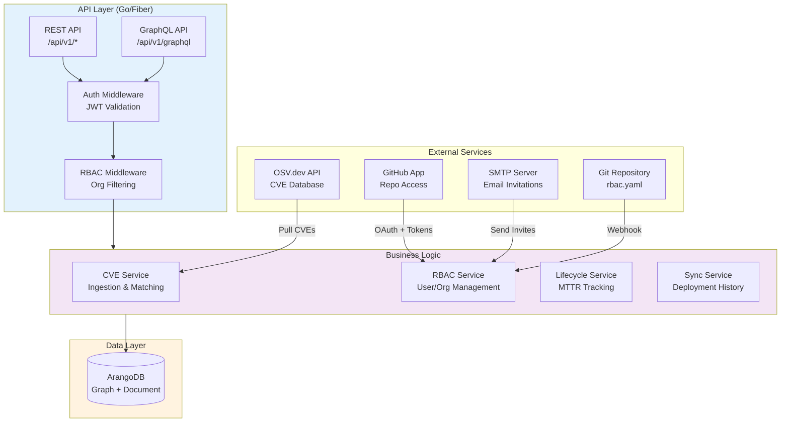

### Technology Stack

| Layer             | Technology       | Purpose                      |
|-------------------|------------------|------------------------------|
| **API Framework** | Fiber v2         | High-performance HTTP server |
| **GraphQL**       | graphql-go       | Query flexibility            |
| **Database**      | ArangoDB 3.11+   | Graph + document store       |
| **Auth**          | golang-jwt/jwt   | JWT generation/validation    |
| **Password**      | bcrypt           | Password hashing             |
| **CVE Data**      | OSV.dev API      | Vulnerability database       |
| **CVSS**          | pandatix/go-cvss | Score calculation            |
| **Git**           | go-git           | GitOps integration           |
| **Email**         | net/smtp         | SMTP invitations             |

---

## Multi-Tenant RBAC System

### Overview

PDVD implements organization-based multi-tenancy with a Peribolos-style YAML configuration stored in Git. Users belong to one or more organizations, and data access is scoped by org membership.

```mermaid
graph TB
    subgraph Users["Users"]
        Alice[alice<br/>owner@acme-corp]
        Bob[bob<br/>editor@acme-corp]
        Charlie[charlie<br/>admin@globex]
        Admin[admin<br/>no orgs = global]
    end
    
    subgraph Orgs["Organizations"]
        Acme[acme-corp<br/>ACME Corporation]
        Globex[globex<br/>Globex Industries]
    end
    
    subgraph Resources["Resources"]
        R1[payment-service<br/>org: acme-corp]
        R2[frontend-app<br/>org: acme-corp]
        R3[api-gateway<br/>org: globex]
        R4[open-source-lib<br/>is_public: true]
    end
    
    Alice --> Acme
    Bob --> Acme
    Charlie --> Globex
    
    Acme --> R1
    Acme --> R2
    Globex --> R3
    
    Admin -.->|sees all| R1
    Admin -.->|sees all| R2
    Admin -.->|sees all| R3
    Admin -.->|sees all| R4
    
    style Alice fill:#c8e6c9
    style Admin fill:#ffccbc
    style R4 fill:#fff9c4
```

### Role Hierarchy

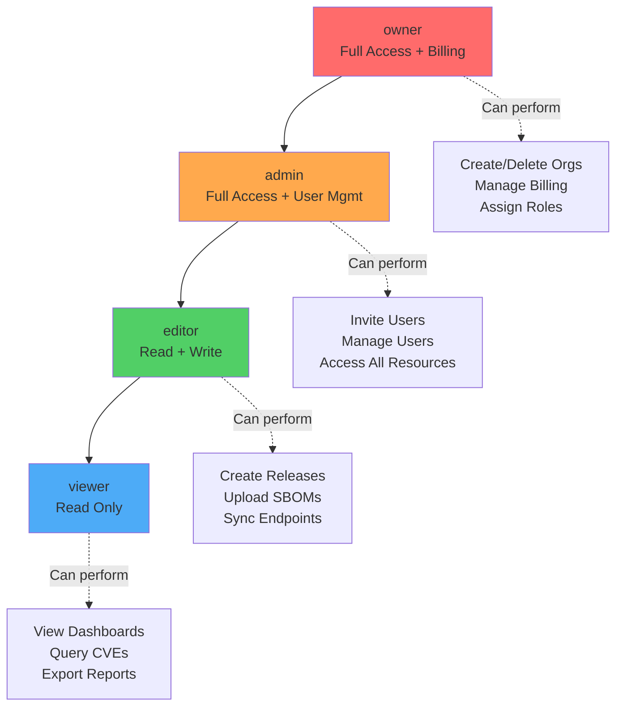

### RBAC Configuration Format

```yaml
# rbac.yaml (Peribolos-style)
orgs:
  - name: acme-corp
    display_name: ACME Corporation
    description: Main engineering organization
    metadata:
      cost_center: CC-1234
      billing_contact: finance@acme.com
    members:
      - username: alice
        role: owner
      - username: bob
        role: editor
      - username: charlie
        role: viewer

  - name: globex
    display_name: Globex Industries
    members:
      - username: charlie
        role: admin

users:
  - username: alice
    email: alice@acme.com
    first_name: Alice
    last_name: Smith
    auth_provider: local
    github_username: alice-gh
    
  - username: bob
    email: bob@acme.com
    first_name: Bob
    last_name: Jones
    auth_provider: github
    github_username: bob-jones

  - username: admin
    email: admin@pdvd.com
    first_name: System
    last_name: Administrator
    auth_provider: local
    # No orgs = global access
```

### GitOps Workflow

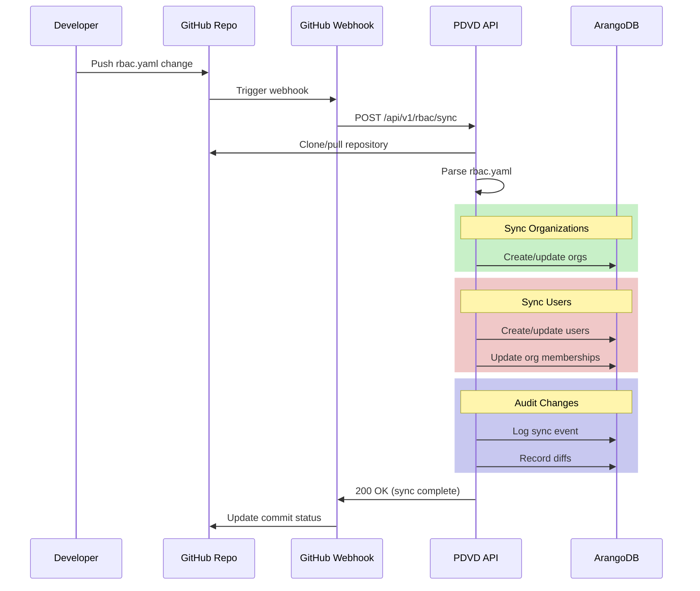

### Data Scoping Rules

1. **Org-Scoped Resources:**
   - Releases with `org` field
   - Endpoints with `org` field
   - SBOMs (inherited from release)
   - Sync records (inherited from endpoint)

2. **Global Resources:**
   - CVEs (shared across all orgs)
   - PURL hubs (shared package index)
   - Users with `orgs: []` (admin-level access)
   - Resources with `is_public: true`

3. **Filtering Logic:**
   ```go
   // Pseudo-code for org filtering
   func filterByOrg(user User, resources []Resource) []Resource {
       if len(user.Orgs) == 0 {
           return resources // Global access
       }
       
       filtered := []Resource{}
       for _, r := range resources {
           if r.IsPublic || contains(user.Orgs, r.Org) {
               filtered = append(filtered, r)
           }
       }
       return filtered
   }
   ```

---

## Authentication & Authorization

### Sign-Up Flow

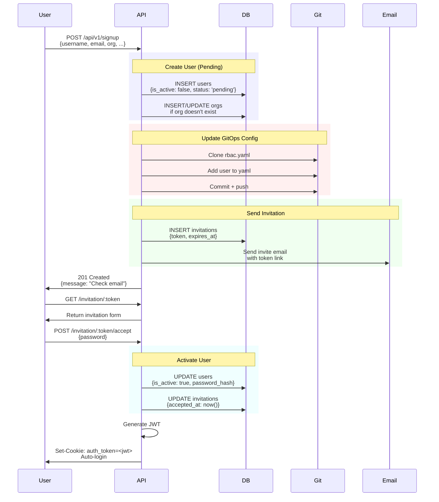

### Login Flow

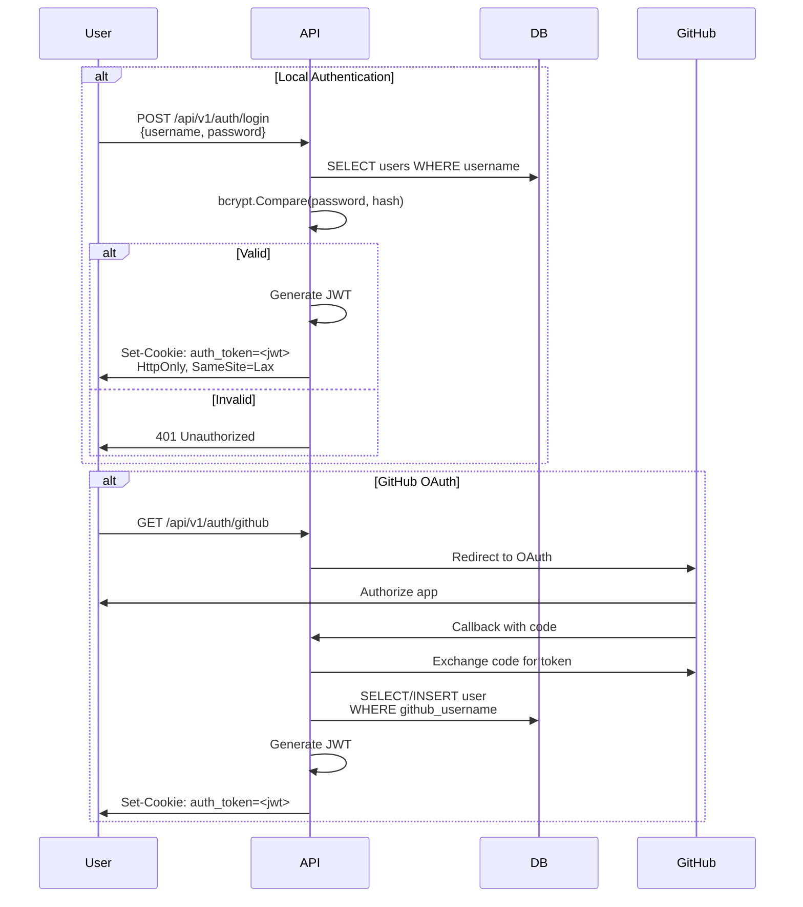

### JWT Structure

```json
{
  "sub": "alice",
  "email": "alice@acme.com",
  "orgs": ["acme-corp"],
  "role": "owner",
  "iat": 1704067200,
  "exp": 1704153600
}
```

**Cookie Settings:**
```
Set-Cookie: auth_token=<jwt>; 
  HttpOnly; 
  Secure; 
  SameSite=Lax; 
  Path=/; 
  Max-Age=86400
```

### Middleware Chain

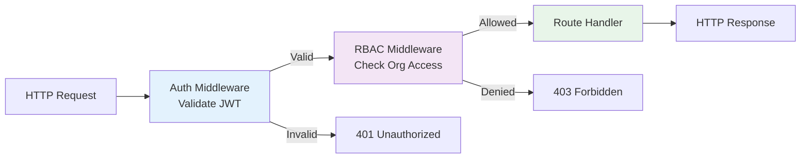

### Permission Matrix

| Resource | Owner | Admin | Editor | Viewer |
|----------|-------|-------|--------|--------|
| **Organizations** |
| Create org | ✅ | ✅ | ❌ | ❌ |
| Delete org | ✅ | ❌ | ❌ | ❌ |
| Update org metadata | ✅ | ✅ | ❌ | ❌ |
| **Users** |
| Invite user | ✅ | ✅ | ❌ | ❌ |
| Revoke user | ✅ | ✅ | ❌ | ❌ |
| Assign roles | ✅ | ✅ | ❌ | ❌ |
| **Releases** |
| Upload release | ✅ | ✅ | ✅ | ❌ |
| Delete release | ✅ | ✅ | ✅ | ❌ |
| View releases | ✅ | ✅ | ✅ | ✅ |
| **Endpoints** |
| Create endpoint | ✅ | ✅ | ✅ | ❌ |
| Sync deployment | ✅ | ✅ | ✅ | ❌ |
| View endpoints | ✅ | ✅ | ✅ | ✅ |
| **Dashboards** |
| View org dashboard | ✅ | ✅ | ✅ | ✅ |
| Export reports | ✅ | ✅ | ✅ | ✅ |

---

## Database Schema

### Collections

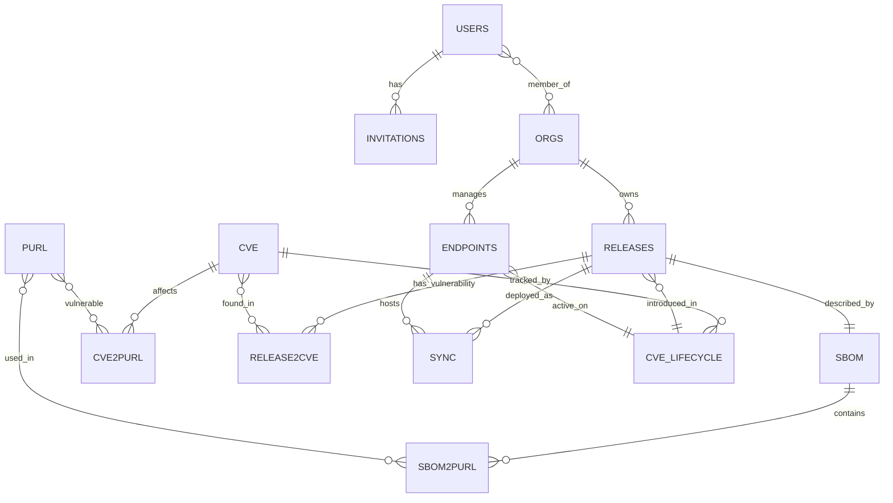

### Core Collections

#### users
```json
{
  "_key": "alice",
  "username": "alice",
  "email": "alice@acme.com",
  "password_hash": "$2a$10$...",
  "first_name": "Alice",
  "last_name": "Smith",
  "orgs": ["acme-corp"],
  "role": "owner",
  "auth_provider": "local",
  "github_username": "alice-gh",
  "github_token": "gho_...",
  "is_active": true,
  "created_at": "2024-01-01T00:00:00Z",
  "last_login": "2024-12-01T10:30:00Z"
}
```

#### orgs
```json
{
  "_key": "acme-corp",
  "name": "acme-corp",
  "display_name": "ACME Corporation",
  "description": "Main engineering organization",
  "metadata": {
    "cost_center": "CC-1234",
    "billing_contact": "finance@acme.com",
    "created_by": "alice"
  },
  "created_at": "2024-01-01T00:00:00Z"
}
```

#### invitations
```json
{
  "_key": "tok_abc123",
  "token": "tok_abc123",
  "username": "bob",
  "email": "bob@acme.com",
  "org": "acme-corp",
  "role": "editor",
  "created_at": "2024-12-01T10:00:00Z",
  "expires_at": "2024-12-03T10:00:00Z",
  "accepted_at": null,
  "status": "pending"
}
```

#### cve
```json
{
  "_key": "CVE-2024-1234",
  "id": "CVE-2024-1234",
  "summary": "Buffer overflow in lodash",
  "details": "An attacker can...",
  "aliases": ["GHSA-xxxx-yyyy"],
  "published": "2024-11-15T00:00:00Z",
  "modified": "2024-11-16T00:00:00Z",
  
  "cvss_base_score": 9.8,
  "cvss_vector": "CVSS:3.1/AV:N/AC:L/PR:N/UI:N/S:U/C:H/I:H/A:H",
  "severity_rating": "CRITICAL",
  
  "affected": [
    {
      "package": {
        "ecosystem": "npm",
        "name": "lodash"
      },
      "ranges": [
        {
          "type": "SEMVER",
          "events": [
            {"introduced": "0"},
            {"fixed": "4.17.21"}
          ]
        }
      ]
    }
  ],
  
  "references": [
    {
      "type": "ADVISORY",
      "url": "https://nvd.nist.gov/vuln/detail/CVE-2024-1234"
    }
  ]
}
```

#### purl
```json
{
  "_key": "pkg:npm/lodash",
  "purl": "pkg:npm/lodash",
  "type": "npm",
  "namespace": null,
  "name": "lodash",
  "version": null,
  "qualifiers": {},
  "subpath": null
}
```

#### sbom
```json
{
  "_key": "sbom_payment-service_2.1.0",
  "release_name": "payment-service",
  "release_version": "2.1.0",
  "org": "acme-corp",
  "format": "CycloneDX",
  "spec_version": "1.5",
  "content": {
    "bomFormat": "CycloneDX",
    "specVersion": "1.5",
    "components": [
      {
        "type": "library",
        "name": "lodash",
        "version": "4.17.20",
        "purl": "pkg:npm/lodash@4.17.20"
      }
    ]
  },
  "created_at": "2024-12-01T00:00:00Z"
}
```

#### release
```json
{
  "_key": "payment-service_2.1.0",
  "name": "payment-service",
  "version": "2.1.0",
  "org": "acme-corp",
  "is_public": false,
  
  "gitcommit": "abc123def456",
  "giturl": "https://github.com/acme/payment-service",
  "gitbranch": "main",
  "gitrepo": "acme/payment-service",
  
  "builddate": "2024-12-01T00:00:00Z",
  "buildid": "build-456",
  "buildurl": "https://ci.acme.com/builds/456",
  
  "dockerrepo": "acme/payment-service",
  "dockersha": "sha256:abc...",
  "dockertag": "2.1.0",
  
  "content_sha": "sha256:def...",
  "openssf_scorecard_score": 8.5,
  
  "created_at": "2024-12-01T00:00:00Z"
}
```

#### endpoint
```json
{
  "_key": "prod-us-east-1",
  "name": "prod-us-east-1",
  "org": "acme-corp",
  "endpoint_type": "eks",
  "environment": "production",
  "is_mission_asset": true,
  
  "metadata": {
    "cluster_name": "prod-us-east-1",
    "region": "us-east-1",
    "namespace": "payment-services",
    "owner_team": "platform-eng"
  },
  
  "created_at": "2024-01-01T00:00:00Z"
}
```

#### sync
```json
{
  "_key": "sync_prod-us-east-1_1733011200",
  "endpoint_name": "prod-us-east-1",
  "org": "acme-corp",
  "timestamp": "2024-12-01T00:00:00Z",
  
  "releases": [
    {
      "name": "payment-service",
      "version": "2.1.0"
    }
  ],
  
  "metadata": {
    "sync_method": "k8s-operator",
    "sync_agent": "pdvd-agent-v1.2.3"
  }
}
```

#### cve_lifecycle
```json
{
  "_key": "lifecycle_CVE-2024-1234_prod-us-east-1_payment-service_2.1.0",
  "cve_id": "CVE-2024-1234",
  "endpoint_name": "prod-us-east-1",
  "release_name": "payment-service",
  "release_version": "2.1.0",
  "org": "acme-corp",
  
  "introduced_at": "2024-12-01T00:00:00Z",
  "root_introduced_at": "2024-12-01T00:00:00Z",
  "remediated_at": null,
  "is_remediated": false,
  
  "disclosed_after_deployment": false,
  "is_mission_asset": true,
  
  "sla_target_days": 7,
  "days_open": 15,
  "days_to_remediate": null,
  "is_beyond_sla": true
}
```

### Edge Collections

#### sbom2purl
```json
{
  "_from": "sbom/sbom_payment-service_2.1.0",
  "_to": "purl/pkg:npm/lodash",
  "version": "4.17.20",
  "scope": "required"
}
```

#### cve2purl
```json
{
  "_from": "cve/CVE-2024-1234",
  "_to": "purl/pkg:npm/lodash",
  "affects_versions": ["<4.17.21"],
  "fixed_in": "4.17.21"
}
```

#### release2cve (Materialized)
```json
{
  "_from": "release/payment-service_2.1.0",
  "_to": "cve/CVE-2024-1234",
  "package": "lodash",
  "version": "4.17.20",
  "severity_rating": "CRITICAL",
  "cvss_base_score": 9.8
}
```

---

## API Specification

### REST Endpoints

#### Authentication

```bash
# Sign-up
POST /api/v1/signup
Content-Type: application/json

{
  "username": "alice",
  "email": "alice@acme.com",
  "first_name": "Alice",
  "last_name": "Smith",
  "organization": "acme-corp",
  "password": "optional-if-invite"
}

Response: 201 Created
{
  "message": "User created. Check email for invitation.",
  "username": "alice",
  "invitation_sent": true
}

# Login
POST /api/v1/auth/login
Content-Type: application/json

{
  "username": "alice",
  "password": "secure-password"
}

Response: 200 OK
Set-Cookie: auth_token=<jwt>; HttpOnly; Secure
{
  "message": "Login successful",
  "user": {
    "username": "alice",
    "email": "alice@acme.com",
    "orgs": ["acme-corp"],
    "role": "owner"
  }
}

# Accept Invitation
POST /api/v1/invitation/:token/accept
Content-Type: application/json

{
  "password": "new-secure-password"
}

Response: 200 OK
Set-Cookie: auth_token=<jwt>
{
  "message": "Account activated",
  "user": { ... }
}

# Logout
POST /api/v1/auth/logout

Response: 200 OK
Set-Cookie: auth_token=; Max-Age=0
```

#### Releases

```bash
# Upload Release + SBOM
POST /api/v1/releases
Authorization: Cookie auth_token=<jwt>
Content-Type: application/json

{
  "name": "payment-service",
  "version": "2.1.0",
  "org": "acme-corp",
  "gitcommit": "abc123",
  "giturl": "https://github.com/acme/payment-service",
  "builddate": "2024-12-01T00:00:00Z",
  "sbom": {
    "content": { /* CycloneDX JSON */ }
  }
}

Response: 201 Created
{
  "release": {
    "_key": "payment-service_2.1.0",
    "name": "payment-service",
    "version": "2.1.0"
  },
  "vulnerabilities_found": 3,
  "critical": 1,
  "high": 2
}

# Get Release Details
GET /api/v1/releases/payment-service/2.1.0
Authorization: Cookie auth_token=<jwt>

Response: 200 OK
{
  "release": { ... },
  "vulnerabilities": [
    {
      "cve_id": "CVE-2024-1234",
      "severity_rating": "CRITICAL",
      "package": "lodash",
      "version": "4.17.20",
      "fixed_in": "4.17.21"
    }
  ],
  "synced_endpoints": [
    {
      "endpoint_name": "prod-us-east-1",
      "environment": "production",
      "last_sync": "2024-12-01T00:00:00Z"
    }
  ]
}
```

#### Sync (Deployments)

```bash
# Sync Endpoint
POST /api/v1/sync
Authorization: Cookie auth_token=<jwt>
Content-Type: application/json

{
  "endpoint_name": "prod-us-east-1",
  "releases": [
    {
      "release": {
        "name": "payment-service",
        "version": "2.1.0"
      }
    }
  ],
  "endpoint": {
    "name": "prod-us-east-1",
    "org": "acme-corp",
    "endpoint_type": "eks",
    "environment": "production"
  }
}

Response: 200 OK
{
  "sync_id": "sync_prod-us-east-1_1733011200",
  "endpoint_name": "prod-us-east-1",
  "releases_synced": 1,
  "lifecycle_updates": {
    "introduced": 0,
    "superseded": 2,
    "remediated": 1
  }
}
```

#### Dashboard

```bash
# Get MTTR Dashboard
GET /api/v1/dashboard/mttr?days=180&org=acme-corp
Authorization: Cookie auth_token=<jwt>

Response: 200 OK
{
  "executive_summary": {
    "total_new_cves": 145,
    "mttr_all": 23.4,
    "mttr_post_deployment": 18.7,
    "mean_open_age": 45.2,
    "open_cves_beyond_sla_pct": 13.2
  },
  "by_severity": [
    {
      "severity": "CRITICAL",
      "mttr": 8.2,
      "open_count": 3,
      "fixed_within_sla_pct": 92.5
    }
  ],
  "by_endpoint": [
    {
      "endpoint_name": "prod-us-east-1",
      "total_cves": 23,
      "critical": 1,
      "high": 5
    }
  ]
}
```

### GraphQL Schema

```graphql
type Query {
  # Releases
  release(name: String!, version: String!): Release
  releases(org: String, limit: Int, offset: Int): [Release!]!
  
  # CVEs
  cve(id: String!): CVE
  cves(severity: Severity, org: String): [CVE!]!
  
  # Endpoints
  endpoint(name: String!): Endpoint
  endpoints(org: String, environment: String): [Endpoint!]!
  
  # Dashboard
  dashboardMTTR(days: Int!, org: String): DashboardMTTR!
  orgAggregatedReleases(severity: Severity): [OrgAggregation!]!
  
  # Organizations
  organizations: [Organization!]!
  organization(name: String!): Organization
  
  # Users
  currentUser: User!
  users(org: String): [User!]!
}

type Mutation {
  # Auth
  signup(input: SignupInput!): SignupResult!
  login(username: String!, password: String!): LoginResult!
  acceptInvitation(token: String!, password: String!): LoginResult!
  
  # Releases
  uploadRelease(input: ReleaseInput!): Release!
  
  # Sync
  syncDeployment(input: SyncInput!): SyncResult!
  
  # Organizations
  createOrganization(input: OrgInput!): Organization!
  inviteUser(input: InviteInput!): InvitationResult!
}

type Release {
  name: String!
  version: String!
  org: String
  gitcommit: String
  builddate: String
  vulnerabilities: [Vulnerability!]!
  synced_endpoints: [SyncedEndpoint!]!
  openssf_scorecard_score: Float
}

type CVE {
  id: String!
  summary: String
  cvss_base_score: Float!
  severity_rating: String!
  published: String
  affected_releases: [Release!]!
}

type Endpoint {
  name: String!
  org: String
  endpoint_type: String!
  environment: String!
  is_mission_asset: Boolean!
  current_releases: [Release!]!
}

type DashboardMTTR {
  executive_summary: ExecutiveSummary!
  by_severity: [SeverityMetrics!]!
  by_endpoint: [EndpointMetrics!]!
}

enum Severity {
  CRITICAL
  HIGH
  MEDIUM
  LOW
}
```

---

## CVE Lifecycle Management

### Lifecycle States

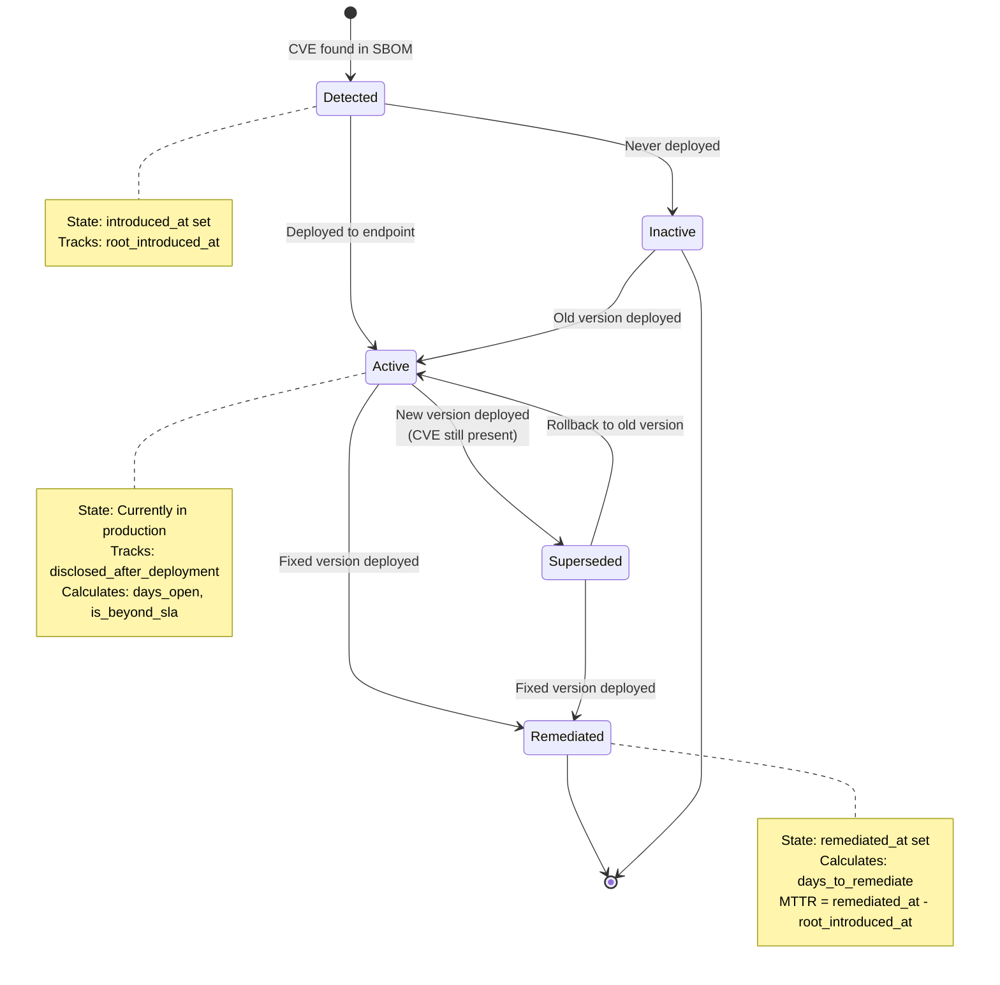

### MTTR Calculation

```
MTTR (Mean Time To Remediate) = Average(days_to_remediate) for all remediated CVEs

days_to_remediate = remediated_at - root_introduced_at

Where:
- root_introduced_at = earliest timestamp CVE was detected (across all versions)
- remediated_at = timestamp when fixed version was deployed
- Only includes CVEs that are is_remediated = true
```

### SLA Compliance

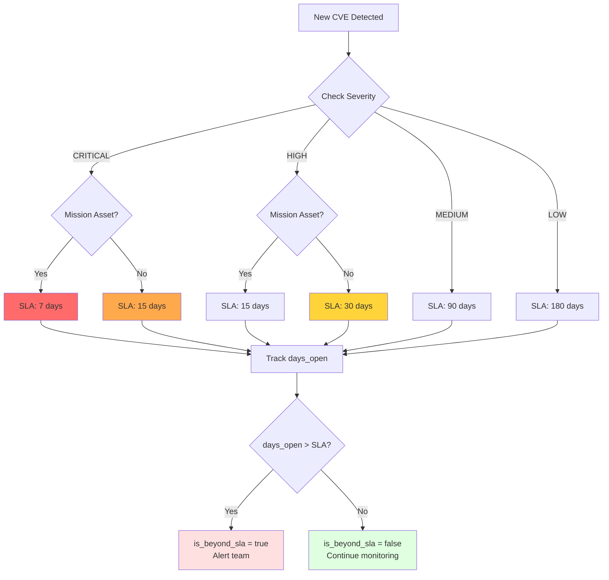

### Post-Deployment Detection

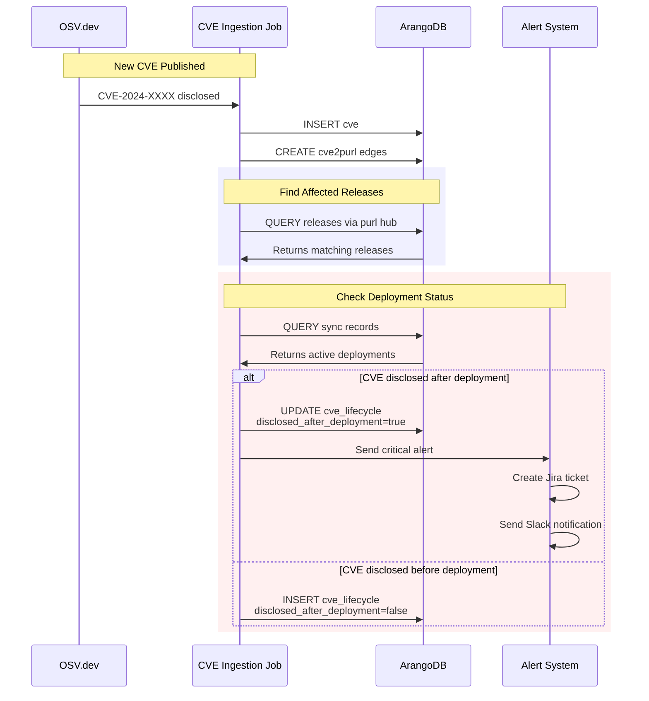

---

## Hub-and-Spoke Graph Design

### Traditional vs Hub-and-Spoke

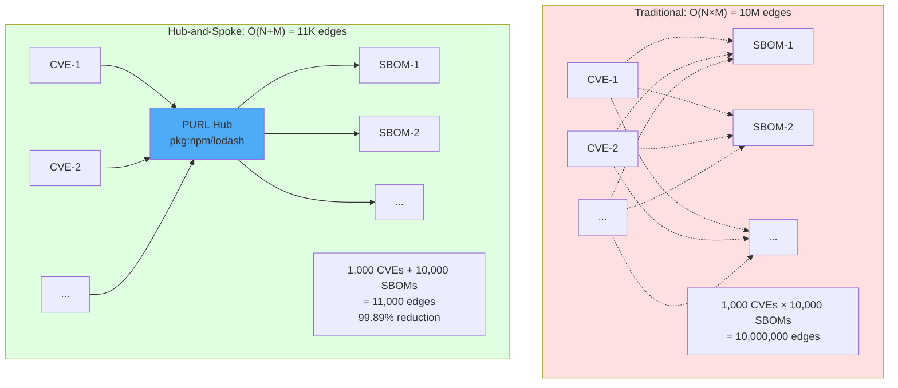

### Query Performance

```
Traditional Graph (N×M):
  Query: "Find all SBOMs affected by CVE-2024-1234"
  Complexity: O(M) = 10,000 edge traversals
  Time: ~30 seconds

Hub-and-Spoke (N+M):
  Query: "Find all SBOMs affected by CVE-2024-1234"
  Complexity: O(1 + K) where K = affected SBOMs
  Time: <3 seconds

Speedup: 10x faster for typical queries
```

### PURL Hub Design

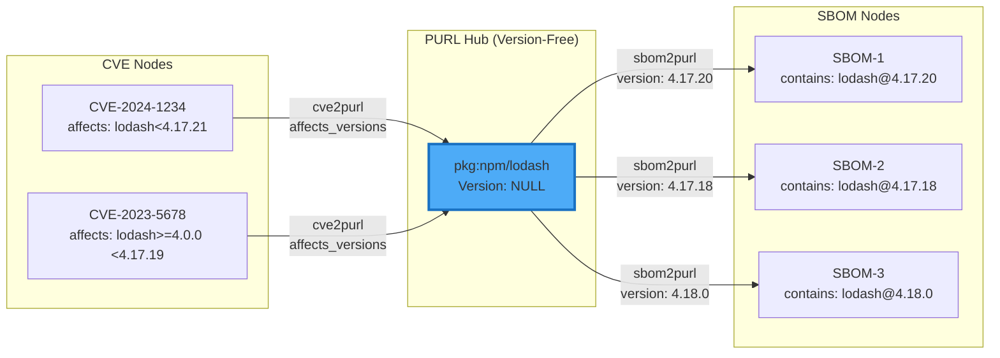

### Version Matching Algorithm

```go
// Pseudo-code for version matching
func findAffectedSBOMs(cve CVE, purl PURLHub) []SBOM {
    // 1. Find all SBOMs connected to this PURL hub
    sboms := graph.OutboundEdges(purl, "sbom2purl")
    
    affected := []SBOM{}
    for _, sbom := range sboms {
        version := sbom.Edge.Version
        
        // 2. Check if SBOM version matches CVE affected ranges
        if cve.AffectsVersion(version) {
            affected = append(affected, sbom)
        }
    }
    
    return affected
}

func (cve *CVE) AffectsVersion(version string) bool {
    for _, affectedPkg := range cve.Affected {
        for _, versionRange := range affectedPkg.Ranges {
            if versionRange.Contains(version) {
                return true
            }
        }
    }
    return false
}
```

---

## Deployment Architecture

### High-Availability Setup

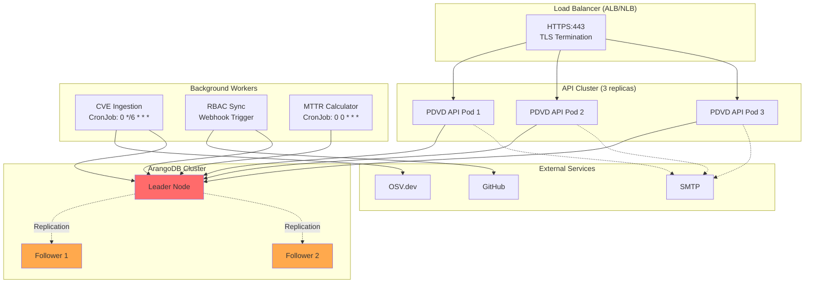

### Kubernetes Manifests

```yaml
# api-deployment.yaml
apiVersion: apps/v1
kind: Deployment
metadata:
  name: pdvd-api
  namespace: pdvd
spec:
  replicas: 3
  selector:
    matchLabels:
      app: pdvd-api
  template:
    metadata:
      labels:
        app: pdvd-api
    spec:
      containers:
      - name: api
        image: pdvd/backend:v2.0.0
        ports:
        - containerPort: 3000
        env:
        - name: ARANGO_HOST
          valueFrom:
            secretKeyRef:
              name: pdvd-secrets
              key: arango-host
        - name: JWT_SECRET
          valueFrom:
            secretKeyRef:
              name: pdvd-secrets
              key: jwt-secret
        resources:
          requests:
            cpu: 500m
            memory: 1Gi
          limits:
            cpu: 2000m
            memory: 4Gi
        livenessProbe:
          httpGet:
            path: /health
            port: 3000
          initialDelaySeconds: 30
          periodSeconds: 10
        readinessProbe:
          httpGet:
            path: /ready
            port: 3000
          initialDelaySeconds: 5
          periodSeconds: 5

---
# cve-ingestion-cronjob.yaml
apiVersion: batch/v1
kind: CronJob
metadata:
  name: cve-ingestion
  namespace: pdvd
spec:
  schedule: "0 */6 * * *"  # Every 6 hours
  jobTemplate:
    spec:
      template:
        spec:
          containers:
          - name: ingest
            image: pdvd/backend:v2.0.0
            command: ["./pdvd-cli", "ingest-cves"]
            env:
            - name: ARANGO_HOST
              valueFrom:
                secretKeyRef:
                  name: pdvd-secrets
                  key: arango-host
          restartPolicy: OnFailure
```

---

## Security Considerations

### Threat Model

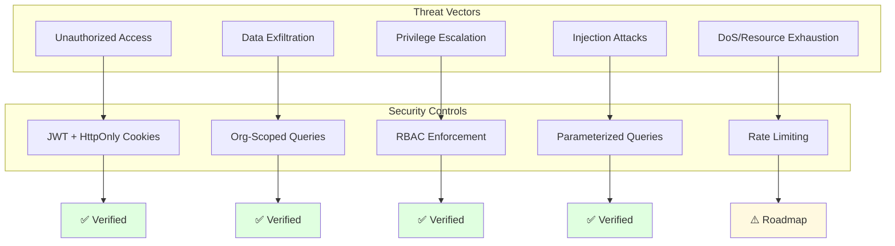

### Best Practices

1. **Password Security:**
   - bcrypt with cost factor 10
   - Minimum 8 characters
   - Password complexity enforced

2. **JWT Security:**
   - 24-hour expiration
   - HttpOnly cookies (XSS protection)
   - Secure flag in production
   - SameSite=Lax (CSRF protection)

3. **Database Security:**
   - Parameterized AQL queries (injection prevention)
   - Least-privilege database user
   - TLS encryption for connections
   - Org-scoped queries via FILTER clause

4. **API Security:**
   - Authentication required on all endpoints (except /health)
   - Rate limiting (roadmap)
   - Input validation
   - Error message sanitization

5. **Secrets Management:**
   - Kubernetes Secrets for credentials
   - GitHub tokens rotated monthly
   - SMTP passwords app-specific
   - JWT secret 256-bit random

---

## Appendix

### Glossary

| Term                  | Definition                                                                      |
|-----------------------|---------------------------------------------------------------------------------|
| **PURL**              | Package URL - standardized package identifier (pkg:type/namespace/name@version) |
| **Hub-and-Spoke**     | Graph pattern using central hub nodes to reduce edge count                      |
| **MTTR**              | Mean Time To Remediate - average days from CVE discovery to fix deployment      |
| **SLA**               | Service Level Agreement - target remediation time based on severity             |
| **SBOM**              | Software Bill of Materials - inventory of software components                   |
| **CVE**               | Common Vulnerabilities and Exposures - unique vulnerability identifier          |
| **CVSS**              | Common Vulnerability Scoring System - severity scoring standard (0-10)          |
| **GitOps**            | Infrastructure/config as code with Git as source of truth                       |
| **Materialized Edge** | Pre-computed edge stored for performance (e.g., release2cve)                    |

### References

- [NIST SP 800-218: Secure Software Development Framework](https://csrc.nist.gov/publications/detail/sp/800-218/final)
- [NIST SP 800-190: Application Container Security Guide](https://csrc.nist.gov/publications/detail/sp/800-190/final)
- [CycloneDX SBOM Specification](https://cyclonedx.org/specification/overview/)
- [Package URL (PURL) Specification](https://github.com/package-url/purl-spec)
- [OSV Schema](https://ossf.github.io/osv-schema/)
- [CVSS v3.1 Specification](https://www.first.org/cvss/v3.1/specification-document)

---

**Document Control:**
- Version: 2.0
- Last Updated: January 2026
- Next Review: April 2026
- Owner: Platform Engineering Team
- Classification: Internal Use
