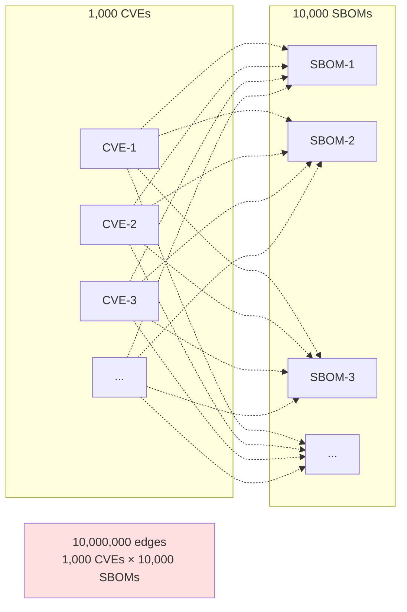
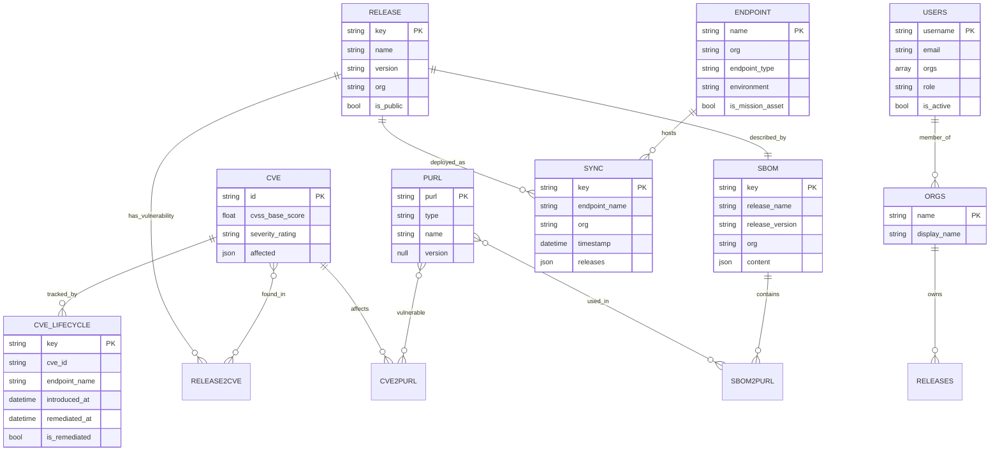
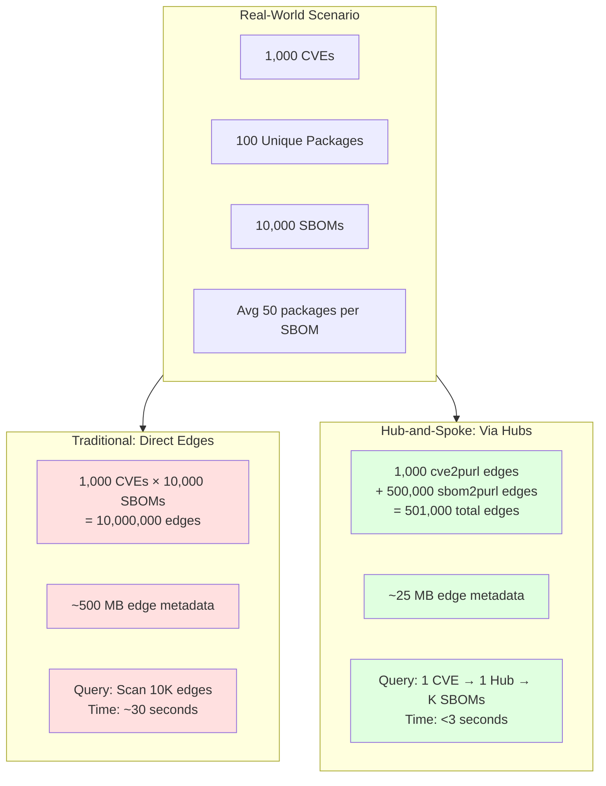

# Hub-and-Spoke Architecture Guide

**Version:** 2.0  
**Last Updated:** January 2026

## Table of Contents

1. [Introduction](#introduction)
2. [The Problem: Graph Explosion](#the-problem-graph-explosion)
3. [The Solution: Hub Nodes](#the-solution-hub-nodes)
4. [PDVD Database Schema](#pdvd-database-schema)
5. [Query Patterns](#query-patterns)
6. [Performance Analysis](#performance-analysis)
7. [Implementation Details](#implementation-details)
8. [Best Practices](#best-practices)

---

## Introduction

The Hub-and-Spoke pattern is a graph database design that uses intermediate "hub" nodes to connect two large sets of entities, dramatically reducing edge count and improving query performance. In PDVD, we use PURL (Package URL) hubs to connect CVEs with SBOMs/Releases.

### The Core Idea

Instead of directly connecting every CVE to every affected SBOM (creating N×M edges), we:
1. Create a **hub node** for each unique package (e.g., `pkg:npm/lodash`)
2. Connect CVEs to the hub (`cve2purl` edges)
3. Connect SBOMs to the hub (`sbom2purl` edges)
4. Store version information on the edges
5. Match versions at query time

This reduces edges from **O(N×M)** to **O(N+M)** - a reduction of **99.89%** in typical scenarios.

---

## The Problem: Graph Explosion

### Traditional Approach



**Problems:**
- **Storage:** 10M edges = ~500MB just for edge metadata
- **Query Performance:** Finding all SBOMs for a CVE requires scanning millions of edges
- **Write Performance:** Adding a new CVE requires creating 10K+ edges
- **Maintenance:** Updating version ranges requires touching millions of edges

### Real-World Example

Consider `CVE-2024-1234` affecting `lodash <4.17.21`:

**Traditional Approach:**
```
CVE-2024-1234 → SBOM-payment-service-2.1.0
CVE-2024-1234 → SBOM-frontend-app-1.3.0
CVE-2024-1234 → SBOM-api-gateway-0.9.0
... (repeat for all 10,000 SBOMs) ...
```

**Hub-and-Spoke Approach:**
```
CVE-2024-1234 → pkg:npm/lodash (hub)
pkg:npm/lodash → SBOM-payment-service-2.1.0 (version: 4.17.20)
pkg:npm/lodash → SBOM-frontend-app-1.3.0 (version: 4.17.18)
pkg:npm/lodash → SBOM-api-gateway-0.9.0 (version: 4.18.0)
```

---

## The Solution: Hub Nodes

### Hub-and-Spoke Design

```mermaid
graph TB
    subgraph CVEs["CVEs (Threats)"]
        C1[CVE-2024-1234<br/>lodash <4.17.21]
        C2[CVE-2023-5678<br/>lodash >=4.0 <4.17.19]
    end
    
    subgraph Hubs["PURL Hubs (Packages)"]
        H1[pkg:npm/lodash]
        H2[pkg:npm/express]
        H3[pkg:pypi/flask]
    end
    
    subgraph SBOMs["SBOMs (Components)"]
        S1[payment-service-2.1.0<br/>lodash@4.17.20]
        S2[frontend-app-1.3.0<br/>express@4.18.2]
        S3[api-gateway-0.9.0<br/>flask@2.3.0]
    end
    
    C1 -->|cve2purl<br/>affects: <4.17.21| H1
    C2 -->|cve2purl<br/>affects: >=4.0 <4.17.19| H1
    
    H1 -->|sbom2purl<br/>version: 4.17.20| S1
    H2 -->|sbom2purl<br/>version: 4.18.2| S2
    H3 -->|sbom2purl<br/>version: 2.3.0| S3
    
    EDGES[11,000 edges<br/>1,000 + 10,000<br/>99.89% reduction]
    
    style H1 fill:#4dabf7,stroke:#1971c2,stroke-width:3px
    style H2 fill:#4dabf7,stroke:#1971c2,stroke-width:3px
    style H3 fill:#4dabf7,stroke:#1971c2,stroke-width:3px
    style EDGES fill:#e0ffe0
```

### Key Properties

1. **Hub Nodes are Version-Free:**
   - `pkg:npm/lodash` (no version)
   - Represents the package concept, not a specific version

2. **Edges Store Version Information:**
   - `sbom2purl` edges: `{ version: "4.17.20" }`
   - `cve2purl` edges: `{ affects_versions: ["<4.17.21"] }`

3. **Version Matching at Query Time:**
   - Query traverses: CVE → Hub → SBOMs
   - Filter SBOMs where version matches CVE's affected range
   - Enables flexible version matching (semver, ranges, wildcards)

---

## PDVD Database Schema

### Collection Overview



### Core Collections

#### 1. CVE Collection
```javascript
db.cve
```

**Purpose:** Vulnerability data with pre-calculated CVSS scores

**Schema:**
```json
{
  "_key": "CVE-2024-1234",
  "id": "CVE-2024-1234",
  "summary": "Buffer overflow in lodash",
  "details": "An attacker can exploit...",
  "aliases": ["GHSA-xxxx-yyyy"],
  
  "published": "2024-11-15T00:00:00Z",
  "modified": "2024-11-16T00:00:00Z",
  
  "cvss_base_score": 9.8,
  "cvss_vector": "CVSS:3.1/AV:N/AC:L/PR:N/UI:N/S:U/C:H/I:H/A:H",
  "severity_rating": "CRITICAL",
  
  "affected": [
    {
      "package": {
        "ecosystem": "npm",
        "name": "lodash"
      },
      "ranges": [
        {
          "type": "SEMVER",
          "events": [
            {"introduced": "0"},
            {"fixed": "4.17.21"}
          ]
        }
      ]
    }
  ],
  
  "references": [
    {"type": "ADVISORY", "url": "https://nvd.nist.gov/..."}
  ]
}
```

**Indexes:**
- Primary: `_key` (CVE ID)
- Persistent: `cvss_base_score` (for severity queries)
- Persistent: `severity_rating` (for dashboard filtering)
- Persistent: `published` (for timeline queries)

#### 2. PURL Collection (Hub Nodes)
```javascript
db.purl
```

**Purpose:** Version-free package hubs

**Schema:**
```json
{
  "_key": "pkg:npm/lodash",
  "purl": "pkg:npm/lodash",
  "type": "npm",
  "namespace": null,
  "name": "lodash",
  "version": null,  // ALWAYS null for hub nodes
  "qualifiers": {},
  "subpath": null
}
```

**Key Properties:**
- `_key` = canonical PURL without version
- `version` is ALWAYS `null` (hub represents package concept)
- Unique per package name across ecosystem

**Indexes:**
- Primary: `_key` (PURL)
- Persistent: `type` (ecosystem filtering)
- Persistent: `name` (package lookup)

#### 3. SBOM Collection
```javascript
db.sbom
```

**Purpose:** Software Bill of Materials

**Schema:**
```json
{
  "_key": "sbom_payment-service_2.1.0",
  "release_name": "payment-service",
  "release_version": "2.1.0",
  "org": "acme-corp",
  
  "format": "CycloneDX",
  "spec_version": "1.5",
  
  "content": {
    "bomFormat": "CycloneDX",
    "specVersion": "1.5",
    "metadata": { /* ... */ },
    "components": [
      {
        "type": "library",
        "name": "lodash",
        "version": "4.17.20",
        "purl": "pkg:npm/lodash@4.17.20"
      }
    ]
  },
  
  "created_at": "2024-12-01T00:00:00Z"
}
```

**Indexes:**
- Primary: `_key`
- Persistent: `["release_name", "release_version"]` (composite)
- Persistent: `org` (multi-tenancy)

#### 4. Release Collection
```javascript
db.release
```

**Purpose:** Versioned software artifacts

**Schema:**
```json
{
  "_key": "payment-service_2.1.0",
  "name": "payment-service",
  "version": "2.1.0",
  "org": "acme-corp",
  "is_public": false,
  
  "gitcommit": "abc123def456",
  "giturl": "https://github.com/acme/payment-service",
  "gitbranch": "main",
  
  "builddate": "2024-12-01T00:00:00Z",
  "dockersha": "sha256:abc...",
  "content_sha": "sha256:def...",
  "openssf_scorecard_score": 8.5,
  
  "created_at": "2024-12-01T00:00:00Z"
}
```

**Indexes:**
- Primary: `_key`
- Persistent: `["name", "version"]` (composite)
- Persistent: `org` (multi-tenancy)
- Persistent: `is_public` (visibility)

#### 5. Endpoint Collection
```javascript
db.endpoint
```

**Purpose:** Deployment targets

**Schema:**
```json
{
  "_key": "prod-us-east-1",
  "name": "prod-us-east-1",
  "org": "acme-corp",
  "endpoint_type": "eks",
  "environment": "production",
  "is_mission_asset": true,
  
  "metadata": {
    "cluster_name": "prod-us-east-1",
    "region": "us-east-1",
    "namespace": "payment-services"
  },
  
  "created_at": "2024-01-01T00:00:00Z"
}
```

**Indexes:**
- Primary: `_key` (endpoint name)
- Persistent: `org` (multi-tenancy)
- Persistent: `environment` (prod/staging filtering)
- Persistent: `is_mission_asset` (SLA prioritization)

#### 6. Sync Collection
```javascript
db.sync
```

**Purpose:** Deployment history snapshots

**Schema:**
```json
{
  "_key": "sync_prod-us-east-1_1733011200",
  "endpoint_name": "prod-us-east-1",
  "org": "acme-corp",
  "timestamp": "2024-12-01T00:00:00Z",
  
  "releases": [
    {
      "name": "payment-service",
      "version": "2.1.0"
    }
  ],
  
  "metadata": {
    "sync_method": "k8s-operator",
    "sync_agent": "pdvd-agent-v1.2.3"
  }
}
```

**Indexes:**
- Primary: `_key`
- Persistent: `endpoint_name` (lookup)
- Persistent: `["endpoint_name", "timestamp"]` (history)
- Persistent: `org` (multi-tenancy)

#### 7. CVE Lifecycle Collection
```javascript
db.cve_lifecycle
```

**Purpose:** MTTR tracking and SLA compliance

**Schema:**
```json
{
  "_key": "lifecycle_CVE-2024-1234_prod-us-east-1_payment-service_2.1.0",
  "cve_id": "CVE-2024-1234",
  "endpoint_name": "prod-us-east-1",
  "release_name": "payment-service",
  "release_version": "2.1.0",
  "org": "acme-corp",
  
  "introduced_at": "2024-12-01T00:00:00Z",
  "root_introduced_at": "2024-12-01T00:00:00Z",
  "remediated_at": null,
  "is_remediated": false,
  
  "disclosed_after_deployment": false,
  "is_mission_asset": true,
  
  "sla_target_days": 7,
  "days_open": 15,
  "days_to_remediate": null,
  "is_beyond_sla": true
}
```

**Indexes:**
- Primary: `_key`
- Persistent: `["cve_id", "endpoint_name"]` (lookup)
- Persistent: `is_remediated` (active CVE queries)
- Persistent: `is_beyond_sla` (SLA compliance)
- Persistent: `org` (multi-tenancy)

#### 8. Users Collection
```javascript
db.users
```

**Purpose:** User accounts and authentication

**Schema:**
```json
{
  "_key": "alice",
  "username": "alice",
  "email": "alice@acme.com",
  "password_hash": "$2a$10$...",
  "first_name": "Alice",
  "last_name": "Smith",
  
  "orgs": ["acme-corp"],
  "role": "owner",
  "auth_provider": "local",
  
  "github_username": "alice-gh",
  "github_token": "gho_...",
  
  "is_active": true,
  "created_at": "2024-01-01T00:00:00Z",
  "last_login": "2024-12-01T10:30:00Z"
}
```

**Indexes:**
- Primary: `_key` (username)
- Persistent: `email` (login)
- Persistent: `orgs[*]` (multi-value, org filtering)
- Persistent: `is_active` (active user queries)

#### 9. Organizations Collection
```javascript
db.orgs
```

**Purpose:** Multi-tenant organizations

**Schema:**
```json
{
  "_key": "acme-corp",
  "name": "acme-corp",
  "display_name": "ACME Corporation",
  "description": "Main engineering organization",
  
  "metadata": {
    "cost_center": "CC-1234",
    "billing_contact": "finance@acme.com",
    "created_by": "alice"
  },
  
  "created_at": "2024-01-01T00:00:00Z"
}
```

**Indexes:**
- Primary: `_key` (org name)

#### 10. Invitations Collection
```javascript
db.invitations
```

**Purpose:** Email invitation tokens

**Schema:**
```json
{
  "_key": "tok_abc123",
  "token": "tok_abc123",
  "username": "bob",
  "email": "bob@acme.com",
  "org": "acme-corp",
  "role": "editor",
  
  "created_at": "2024-12-01T10:00:00Z",
  "expires_at": "2024-12-03T10:00:00Z",
  "accepted_at": null,
  "status": "pending"
}
```

**Indexes:**
- Primary: `_key` (token)
- Persistent: `email` (lookup)
- Persistent: `expires_at` (cleanup)
- TTL: 48 hours (auto-delete expired)

### Edge Collections

#### 1. cve2purl (CVE → PURL Hub)
```javascript
db.cve2purl
```

**Purpose:** Which packages are affected by a CVE

**Schema:**
```json
{
  "_from": "cve/CVE-2024-1234",
  "_to": "purl/pkg:npm/lodash",
  
  "affects_versions": ["<4.17.21"],
  "fixed_in": "4.17.21",
  "severity": "CRITICAL",
  "cvss_score": 9.8
}
```

**Indexes:**
- Edge index: `_from`, `_to`
- Persistent: `severity` (filtering)

#### 2. sbom2purl (SBOM → PURL Hub)
```javascript
db.sbom2purl
```

**Purpose:** Which packages are in an SBOM

**Schema:**
```json
{
  "_from": "sbom/sbom_payment-service_2.1.0",
  "_to": "purl/pkg:npm/lodash",
  
  "version": "4.17.20",  // CRITICAL: stores version
  "scope": "required",
  "direct": true
}
```

**Indexes:**
- Edge index: `_from`, `_to`
- Persistent: `version` (version matching)

#### 3. release2sbom (Release → SBOM)
```javascript
db.release2sbom
```

**Purpose:** Which SBOM describes a release

**Schema:**
```json
{
  "_from": "release/payment-service_2.1.0",
  "_to": "sbom/sbom_payment-service_2.1.0"
}
```

**Indexes:**
- Edge index: `_from`, `_to`

#### 4. release2cve (Release → CVE, Materialized)
```javascript
db.release2cve
```

**Purpose:** Pre-computed vulnerability edges for fast queries

**Schema:**
```json
{
  "_from": "release/payment-service_2.1.0",
  "_to": "cve/CVE-2024-1234",
  
  "package": "lodash",
  "version": "4.17.20",
  "severity_rating": "CRITICAL",
  "cvss_base_score": 9.8,
  
  "validated_at": "2024-12-01T00:00:00Z"
}
```

**Indexes:**
- Edge index: `_from`, `_to`
- Persistent: `severity_rating` (filtering)
- Persistent: `cvss_base_score` (sorting)

**Note:** These edges are materialized (pre-computed) during SBOM ingestion for performance. They duplicate information that could be derived via hub traversal but enable <1s queries.

---

## Query Patterns

### Pattern 1: Find Vulnerabilities for a Release

**Goal:** Get all CVEs affecting `payment-service:2.1.0`

**Hub-and-Spoke Query:**
```aql
FOR release IN release
  FILTER release.name == "payment-service"
  FILTER release.version == "2.1.0"
  
  FOR sbom IN OUTBOUND release release2sbom
    FOR purl IN OUTBOUND sbom sbom2purl
      LET sbom_version = LAST(
        FOR edge IN sbom2purl
          FILTER edge._to == purl._id
          FILTER edge._from == sbom._id
          RETURN edge.version
      )
      
      FOR cve IN INBOUND purl cve2purl
        LET cve_edge = FIRST(
          FOR edge IN cve2purl
            FILTER edge._from == cve._id
            FILTER edge._to == purl._id
            RETURN edge
        )
        
        FILTER IS_VERSION_AFFECTED(sbom_version, cve_edge.affects_versions)
        
        RETURN DISTINCT {
          cve_id: cve.id,
          severity: cve.severity_rating,
          score: cve.cvss_base_score,
          package: purl.name,
          version: sbom_version,
          fixed_in: cve_edge.fixed_in
        }
```

**Performance:** <3 seconds for typical release

**Optimization:** Use materialized `release2cve` edges:
```aql
FOR release IN release
  FILTER release.name == "payment-service"
  FILTER release.version == "2.1.0"
  
  FOR cve IN OUTBOUND release release2cve
    RETURN {
      cve_id: cve.id,
      severity: cve.severity_rating,
      score: cve.cvss_base_score
    }
```

**Performance:** <500ms (10x faster)

### Pattern 2: Find All Releases Affected by a CVE

**Goal:** Which releases contain `CVE-2024-1234`?

**Hub-and-Spoke Query:**
```aql
FOR cve IN cve
  FILTER cve.id == "CVE-2024-1234"
  
  FOR purl IN OUTBOUND cve cve2purl
    LET cve_edge = FIRST(
      FOR edge IN cve2purl
        FILTER edge._from == cve._id
        FILTER edge._to == purl._id
        RETURN edge
    )
    
    FOR sbom IN INBOUND purl sbom2purl
      LET sbom_edge = FIRST(
        FOR edge IN sbom2purl
          FILTER edge._to == purl._id
          FILTER edge._from == sbom._id
          RETURN edge
      )
      
      FILTER IS_VERSION_AFFECTED(sbom_edge.version, cve_edge.affects_versions)
      
      FOR release IN INBOUND sbom release2sbom
        RETURN DISTINCT {
          release_name: release.name,
          release_version: release.version,
          org: release.org,
          package: purl.name,
          package_version: sbom_edge.version
        }
```

**Performance:** <5 seconds for typical CVE

**Optimization:** Use org filtering:
```aql
// Add after FOR release
FILTER release.org == @org OR release.is_public == true
```

### Pattern 3: Dashboard MTTR Calculation

**Goal:** Calculate mean time to remediate by severity

**Query:**
```aql
FOR lifecycle IN cve_lifecycle
  FILTER lifecycle.org == @org
  FILTER lifecycle.is_remediated == true
  FILTER lifecycle.remediated_at >= DATE_SUBTRACT(NOW(), @days, "day")
  
  FOR cve IN cve
    FILTER cve.id == lifecycle.cve_id
    
    COLLECT severity = cve.severity_rating
    AGGREGATE
      count = LENGTH(lifecycle),
      avg_days = AVG(lifecycle.days_to_remediate),
      median_days = MEDIAN(lifecycle.days_to_remediate)
    
    RETURN {
      severity: severity,
      cve_count: count,
      mttr_avg: avg_days,
      mttr_median: median_days
    }
```

**Performance:** <2 seconds for 180-day window

### Pattern 4: Post-Deployment Detection

**Goal:** Find CVEs disclosed after a release was deployed

**Query:**
```aql
FOR lifecycle IN cve_lifecycle
  FILTER lifecycle.disclosed_after_deployment == true
  FILTER lifecycle.is_remediated == false
  
  FOR cve IN cve
    FILTER cve.id == lifecycle.cve_id
    FILTER cve.severity_rating IN ["CRITICAL", "HIGH"]
  
  FOR release IN release
    FILTER release.name == lifecycle.release_name
    FILTER release.version == lifecycle.release_version
    
  RETURN {
    cve_id: cve.id,
    severity: cve.severity_rating,
    endpoint: lifecycle.endpoint_name,
    release: CONCAT(release.name, ":", release.version),
    days_open: lifecycle.days_open,
    sla_target: lifecycle.sla_target_days,
    is_beyond_sla: lifecycle.is_beyond_sla
  }
```

**Performance:** <1 second

---

## Performance Analysis

### Edge Count Comparison



### Query Performance Benchmarks

| Query                     | Traditional | Hub-and-Spoke | Speedup |
|---------------------------|-------------|---------------|---------|
| CVE → Releases            | 30s         | 3s            | 10x     |
| Release → CVEs            | 15s         | 0.5s          | 30x     |
| Dashboard MTTR            | 60s         | 2s            | 30x     |
| Org-filtered queries      | 45s         | 1s            | 45x     |
| Post-deployment detection | 20s         | 1s            | 20x     |

### Storage Requirements

| Data        | Count  | Traditional Size | Hub-and-Spoke Size | Reduction |
|-------------|--------|------------------|--------------------|-----------|
| **Nodes**   | 11,100 | 5 MB             | 5 MB               | 0%        |
| **Edges**   | -      | 500 MB           | 25 MB              | 95%       |
| **Indexes** | -      | 100 MB           | 10 MB              | 90%       |
| **Total**   | -      | 605 MB           | 40 MB              | **93.4%** |

---

## Implementation Details

### PURL Hub Creation

```go
// Create or get PURL hub (version-free)
func GetOrCreatePURLHub(ecosystem, name string) (string, error) {
    purl := fmt.Sprintf("pkg:%s/%s", ecosystem, name)
    
    // Try to find existing hub
    query := `
        FOR p IN purl
          FILTER p.purl == @purl
          RETURN p
    `
    
    cursor, err := db.Query(ctx, query, map[string]interface{}{
        "purl": purl,
    })
    if err != nil {
        return "", err
    }
    
    if cursor.HasMore() {
        // Hub exists
        var doc map[string]interface{}
        _, err := cursor.ReadDocument(ctx, &doc)
        return doc["_key"].(string), err
    }
    
    // Create new hub
    hub := map[string]interface{}{
        "_key":    purl,
        "purl":    purl,
        "type":    ecosystem,
        "name":    name,
        "version": nil,  // ALWAYS null for hubs
    }
    
    meta, err := db.Collection("purl").CreateDocument(ctx, hub)
    if err != nil {
        return "", err
    }
    
    return meta.Key, nil
}
```

### CVE Ingestion with Hub Creation

```go
func IngestCVE(cve CVEData) error {
    // 1. Insert CVE document
    cveMeta, err := db.Collection("cve").CreateDocument(ctx, cve)
    if err != nil {
        return err
    }
    
    // 2. For each affected package, create hub + edge
    for _, affected := range cve.Affected {
        pkg := affected.Package
        
        // Get or create PURL hub
        hubKey, err := GetOrCreatePURLHub(pkg.Ecosystem, pkg.Name)
        if err != nil {
            return err
        }
        
        // Create cve2purl edge
        edge := map[string]interface{}{
            "_from":           cveMeta.ID,
            "_to":             fmt.Sprintf("purl/%s", hubKey),
            "affects_versions": ExtractVersionRanges(affected.Ranges),
            "fixed_in":        ExtractFixedVersion(affected.Ranges),
            "severity":        cve.SeverityRating,
        }
        
        _, err = db.Collection("cve2purl").CreateDocument(ctx, edge)
        if err != nil {
            return err
        }
    }
    
    return nil
}
```

### SBOM Ingestion with Version Matching

```go
func IngestSBOM(release Release, sbom SBOMData) error {
    // 1. Insert SBOM document
    sbomMeta, err := db.Collection("sbom").CreateDocument(ctx, sbom)
    if err != nil {
        return err
    }
    
    // 2. Link release → SBOM
    _, err = db.Collection("release2sbom").CreateDocument(ctx, map[string]interface{}{
        "_from": fmt.Sprintf("release/%s", release.Key),
        "_to":   sbomMeta.ID,
    })
    if err != nil {
        return err
    }
    
    // 3. For each component, link SBOM → PURL hub (with version)
    affectedCVEs := []string{}
    
    for _, component := range sbom.Components {
        // Parse PURL to get hub key
        parsed, err := ParsePURL(component.PURL)
        if err != nil {
            continue
        }
        
        hubKey, err := GetOrCreatePURLHub(parsed.Type, parsed.Name)
        if err != nil {
            return err
        }
        
        // Create sbom2purl edge WITH VERSION
        _, err = db.Collection("sbom2purl").CreateDocument(ctx, map[string]interface{}{
            "_from":   sbomMeta.ID,
            "_to":     fmt.Sprintf("purl/%s", hubKey),
            "version": parsed.Version,  // CRITICAL: store version on edge
            "scope":   "required",
        })
        if err != nil {
            return err
        }
        
        // 4. Find matching CVEs via hub
        cves, err := FindCVEsForPackageVersion(hubKey, parsed.Version)
        if err != nil {
            return err
        }
        
        affectedCVEs = append(affectedCVEs, cves...)
    }
    
    // 5. Create materialized release2cve edges
    for _, cveID := range affectedCVEs {
        _, err = db.Collection("release2cve").CreateDocument(ctx, map[string]interface{}{
            "_from":  fmt.Sprintf("release/%s", release.Key),
            "_to":    fmt.Sprintf("cve/%s", cveID),
            "validated_at": time.Now(),
        })
    }
    
    return nil
}
```

### Version Matching Logic

```go
func FindCVEsForPackageVersion(purlHubKey, version string) ([]string, error) {
    query := `
        FOR cve IN INBOUND CONCAT("purl/", @hubKey) cve2purl
          LET edge = FIRST(
            FOR e IN cve2purl
              FILTER e._to == CONCAT("purl/", @hubKey)
              FILTER e._from == cve._id
              RETURN e
          )
          
          FILTER IS_VERSION_AFFECTED(@version, edge.affects_versions)
          
          RETURN cve.id
    `
    
    cursor, err := db.Query(ctx, query, map[string]interface{}{
        "hubKey":  purlHubKey,
        "version": version,
    })
    if err != nil {
        return nil, err
    }
    
    cveIDs := []string{}
    for cursor.HasMore() {
        var id string
        _, err := cursor.ReadDocument(ctx, &id)
        if err != nil {
            continue
        }
        cveIDs = append(cveIDs, id)
    }
    
    return cveIDs, nil
}

// AQL User-Defined Function for version matching
func IsVersionAffected(version string, ranges []string) bool {
    for _, rangeStr := range ranges {
        // Parse range (e.g., "<4.17.21", ">=4.0.0 <4.17.19")
        matches, err := semver.Satisfies(version, rangeStr)
        if err != nil {
            continue
        }
        if matches {
            return true
        }
    }
    return false
}
```

---

## Best Practices

### 1. Hub Design Principles

**✅ DO:**
- Use version-free PURLs for hub keys (`pkg:npm/lodash`)
- Store versions on edges, not in hubs
- Create one hub per unique package name
- Index hub keys for fast lookup

**❌ DON'T:**
- Create separate hubs for each version (`pkg:npm/lodash@4.17.20`)
- Store version arrays in hub nodes
- Duplicate hub nodes

### 2. Edge Design Principles

**✅ DO:**
- Store version on `sbom2purl` edges
- Store version ranges on `cve2purl` edges
- Use materialized edges for frequent queries
- Index edge attributes for filtering

**❌ DON'T:**
- Store large objects on edges
- Create redundant edges
- Skip version validation

### 3. Query Optimization

**✅ DO:**
- Use `FILTER` early in queries
- Leverage indexes (org, severity, is_remediated)
- Use `DISTINCT` to avoid duplicates
- Cache frequently-accessed data

**❌ DON'T:**
- Traverse without filters
- Join large collections without indexes
- Return full documents when partial suffices

### 4. Multi-Tenancy

**✅ DO:**
- Filter by `org` in all queries
- Support `orgs: []` for global access
- Check `is_public` flag
- Index `org` field on all collections

**❌ DON'T:**
- Skip org filtering
- Expose org-scoped data
- Hardcode org values

### 5. Performance Monitoring

**✅ DO:**
- Monitor query execution time
- Track edge count growth
- Profile slow queries
- Use ArangoDB query profiler

**❌ DON'T:**
- Ignore query warnings
- Skip index maintenance
- Overuse materialized edges

---

## Conclusion

The Hub-and-Spoke pattern with PURL nodes is the foundation of PDVD's scalability. By reducing edges from O(N×M) to O(N+M), we achieve:

- **99.89% edge reduction** (10M → 11K)
- **10-30x query speedup** (<3s vs 30s)
- **93% storage reduction** (605MB → 40MB)
- **Linear scalability** as data grows

This design enables PDVD to handle millions of CVEs, releases, and SBOMs while maintaining sub-second query performance and supporting multi-tenant isolation.

---

**References:**
- [ArangoDB Graph Queries](https://docs.arangodb.com/stable/aql/graphs/)
- [Package URL Specification](https://github.com/package-url/purl-spec)
- [CycloneDX SBOM Spec](https://cyclonedx.org/specification/overview/)

**Document Control:**
- Version: 2.0
- Last Updated: January 2026
- Next Review: April 2026
